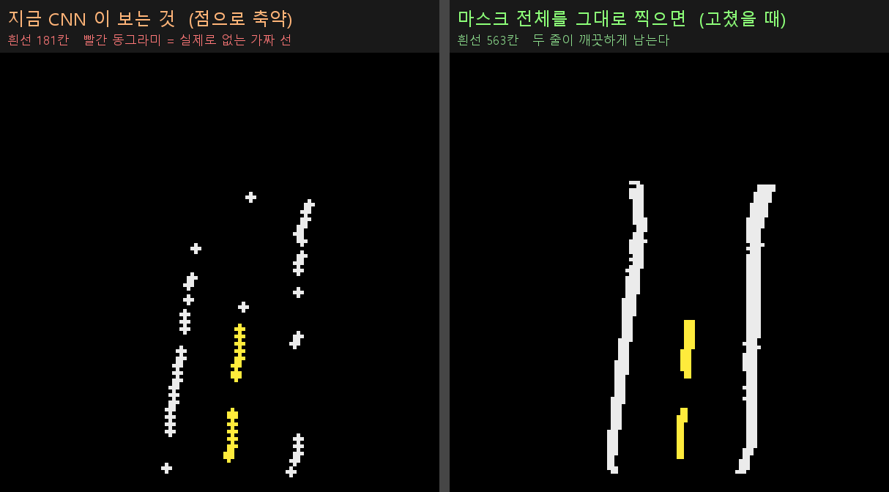

# 2026 국민대학교 자율주행 경진대회
### Legend KHUSLA · 본선 8위 · 전체 코스 완주

**실차에서 불안정해진 차선 피팅을 카메라·LiDAR 기반 경로 생성으로 재설계하고, 데이터 구축부터 차량 제어까지 연결한 프로젝트입니다.**

예선에서는 노란 중앙선에 2차곡선을 맞춰 주행했습니다. 본선 실차에서 점선이 일부만 검출되고 갈림길 정보가 사라지는 문제를 발견한 뒤, 노란선·흰선·LiDAR를 공통 BEV 좌표계에 결합했습니다. CNN은 전방 경로를 생성하고, 별도 제어 노드가 조향과 속도를 담당하도록 구성했습니다.

| 항목 | 내용 |
|---|---|
| 기간 | 2026.05–2026.08 · 본선 2026.08.25 |
| 대회 결과 | 예선 130팀 → 본선 22팀 진출 → **최종 8위**, 전체 코스 완주 |
| 실행 환경 | Ryzen 7 5700U CPU 차량 PC · 카메라 · LiDAR · VESC |
| 주요 기술 | Python · ROS 2 / ROS 1 연동 · OpenCV · YOLO · PyTorch · OpenVINO |
| 본선 기준 | V7 · 팀 원본 커밋 `467f6dd` |

[전체 코드](https://github.com/jounget5411-lab/2026-Legend-KHUSLA) · [문제 해결 사례](docs/engineering-cases.md) · [성능과 설계 상세](docs/technical-notes.md) · [코드 살펴보기](docs/source-guide.md)

## 해결한 문제

### 갈림길이 사라진 원인은 해상도가 아닌 후처리였다

처음에는 YOLO 입력 해상도가 낮아 지름길 차선이 잘린다고 의심했습니다. 그러나 검출 마스크와 BEV를 단계별로 비교하니, **전방 거리 구간마다 횡방향 중앙값 하나만 남기는 후처리**가 같은 위치의 여러 차선을 합치고 있었습니다.

추론 해상도를 높이는 대신 마스크의 2차원 점유 형태를 보존했습니다. 노란 중앙선이 드문드문 남아도 양옆 흰선과 장애물 정보를 함께 사용할 수 있도록 **3채널 BEV → 전방 28개 경로점**으로 입력과 출력을 정의했습니다.

*BEV 표현 개선 전후: 대표점으로 축약한 차선(왼쪽)과 갈림길 형태를 보존한 차선 마스크(오른쪽).*

### LiDAR를 추가하자 경로가 나빠졌다

같은 장면에서 LiDAR 채널만 끄면 경로가 회복됐습니다. 학습 입력의 장애물은 희소했지만 실차 입력에는 벽·차체·사람·여러 콘이 함께 들어왔습니다. 모델을 바꾸기 전에 학습과 차량 입력의 분포가 다르다는 점을 확인했습니다.

실제 카메라·LiDAR 데이터를 다시 수집하고 전처리를 통일했습니다. 일반 주행·지름길·추월 모델에는 도로 밖 점을 제거하고, 라바콘 모델에는 도로 밖 콘도 남겨 **주행 상황에 맞는 센서 정보**를 전달했습니다.

### 빠른 모델도 시스템 안에서는 느려졌다

단독 실행 약 50 ms였던 검출 모델이 실주행에서는 평균 약 181 ms까지 느려졌습니다. CPU 부하와 ROS 전송을 분리해 살펴본 결과, 모든 토픽을 연결하는 브리지가 고해상도 영상과 여러 압축 형식까지 처리하고 있었습니다.

필요한 토픽만 연결하는 브리지, 필요한 원본 영상만 전달하는 설정, 최신 프레임만 남기는 버퍼, 공유 메모리 전송을 적용했습니다. 모델 최적화에 더해 **데이터 이동과 CPU 자원 경합**을 함께 다뤘습니다.

[가설을 분리한 실험, 모터 제어 개선, 대회 직전 판단 더 보기 →](docs/engineering-cases.md)

## 본선 V7의 데이터 흐름

| 단계 | 구현 |
|---|---|
| 인지 | YOLO로 차선·중앙선·구간 표식을 검출하고, 신호등 박스가 있을 때만 별도 분류기 실행 |
| 공통 표현 | 노란선·흰선·LiDAR의 **3 × 128 × 120 BEV**, 셀당 2.5 cm |
| 경로 생성 | 전방 0.3–3.0 m의 28개 고정 위치에 횡방향 좌표와 유효도를 예측 |
| 모드 선택 | 일반·지름길·추월·라바콘 모델을 로드하고 활성 모델 하나만 추론 |
| 주행 제어 | 전방 목표점 추종, 조향 평활화, 모드별 속도, 가감속 변화량 제한 · **20 Hz 설정** |
| 관찰 | 실제 CNN 입력·경로·모드·신호·차량 명령을 진단 뷰어에서 확인 |

**최종 V7의 추월에는 LiDAR 기반 고정 조향 시퀀스(`hardcoded_all`)를 적용했습니다.** 장애물의 방향을 판단한 뒤 실차에서 조정한 조향 블록을 실행합니다. 같은 제어 노드 안에서 경로 추종과 배타적으로 동작하도록 구성해 모터 명령 충돌을 방지했습니다.

## 데이터와 성능

경로 정답은 자동 생성한 후보를 사람이 검수하고, 잘못된 경로를 보정 도구로 다시 그려 만들었습니다. 원본과 수정본을 분리해 이력을 남겼으며, 일반 주행 모델은 연속 프레임이 학습·평가에 섞이지 않도록 주행 시퀀스 단위로 나눴습니다.

| 항목 | 결과 | 측정·평가 조건 |
|---|---|---|
| 일반 경로 CNN | **경로 예측 MAE 8.045 cm** | 주행 시퀀스 단위로 분리한 테스트 321장 |
| YOLO 실행 방식 비교 | p50 **91.76 → 51.03 ms** | 같은 녹화 프레임의 PyTorch / OpenVINO 비교 |
| 경로 발행률 | **11.948 Hz** | 2026-08-21, 뷰어·브리지를 제외한 계측 조건 |

예선 130팀 중 본선 22팀에 진출했으며, **전체 코스를 완주하고 최종 8위**를 기록했습니다. 모델 평가와 처리율 측정 조건은 [성능과 설계 상세](docs/technical-notes.md)에 정리했습니다.

## 개발 단계

| 단계 | 접근 방식 | 코드 |
|---|---|---|
| 예선 | YOLO 인식, 센서 융합, 2차곡선 피팅과 상태 머신, 다점 경로 추종 | [예선 코드](https://github.com/jounget5411-lab/2026-Legend-KHUSLA/tree/8036461664402a54821b0665a4434e961f9a2e76/예선/src/track_drive) |
| 실차 전환 | 카메라·BEV·조향 보정, 입력 정보 손실과 센서 분포 차이 분석 | [초기 실차 이식 코드](https://github.com/jounget5411-lab/2026-Legend-KHUSLA/tree/8036461664402a54821b0665a4434e961f9a2e76/보관/예선코드_차량이식) |
| 본선 V7 | 상황별 CNN, 단순 경로 추종, 고정 조향 기반 추월, 실행 조건 고정 | [본선 코드](https://github.com/jounget5411-lab/2026-Legend-KHUSLA/tree/8036461664402a54821b0665a4434e961f9a2e76/본선/src/track_drive_cnn_gpt) |

## 코드를 빠르게 살펴보려면

| 관심 내용 | 먼저 볼 파일 |
|---|---|
| 카메라 인식과 BEV 생성 | [yolo_bev_node.py](https://github.com/jounget5411-lab/2026-Legend-KHUSLA/blob/8036461664402a54821b0665a4434e961f9a2e76/본선/src/track_drive_cnn_gpt/track_drive_cnn_gpt/yolo_bev_node.py) |
| 입력·출력 규격 | [path_contract.py](https://github.com/jounget5411-lab/2026-Legend-KHUSLA/blob/8036461664402a54821b0665a4434e961f9a2e76/본선/src/track_drive_cnn_gpt/track_drive_cnn_gpt/path_contract.py) |
| LiDAR 결합과 경로 모델 선택 | [cnn_path_node.py](https://github.com/jounget5411-lab/2026-Legend-KHUSLA/blob/8036461664402a54821b0665a4434e961f9a2e76/본선/src/track_drive_cnn_gpt/track_drive_cnn_gpt/cnn_path_node.py) |
| 조향·속도 계산 | [simple_motion_node.py](https://github.com/jounget5411-lab/2026-Legend-KHUSLA/blob/8036461664402a54821b0665a4434e961f9a2e76/본선/src/track_drive_cnn_gpt/track_drive_cnn_gpt/simple_motion_node.py) |
| 최종 모델·인지 설정 | [perception_cnn.yaml](https://github.com/jounget5411-lab/2026-Legend-KHUSLA/blob/8036461664402a54821b0665a4434e961f9a2e76/본선/src/track_drive_cnn_gpt/config/perception_cnn.yaml) |
| 모델 파일과 배포 기록 | [manifest.json](https://github.com/jounget5411-lab/2026-Legend-KHUSLA/blob/8036461664402a54821b0665a4434e961f9a2e76/본선_배포모델/manifest.json) |

## 실행 환경과 코드 출처

본선은 Ubuntu·ROS 2 Humble과 차량별 센서·모터 설정을 전제로 합니다. 모델 배치와 환경 복원 조건은 [본선 V7 안내](https://github.com/jounget5411-lab/2026-Legend-KHUSLA/blob/8036461664402a54821b0665a4434e961f9a2e76/본선_최종_V7_안내.md)를 참고하세요.

전체 코드는 [팀 프로젝트 보관 저장소](https://github.com/jounget5411-lab/2026-Legend-KHUSLA/tree/8036461664402a54821b0665a4434e961f9a2e76)에서 확인할 수 있습니다. 본선 V7의 원본은 [KHUSLA-SANDI/KOOKMIN](https://github.com/KHUSLA-SANDI/KOOKMIN/tree/467f6dda6b71c48567225d3260d925d72818e3c1)에 보관되어 있습니다.

---

[FPGA 드론 프로젝트](https://github.com/jounget5411-lab/fpga-drone-portfolio) · [HL FMA 2025 프로젝트](https://github.com/jounget5411-lab/hlfma-2025-portfolio)
