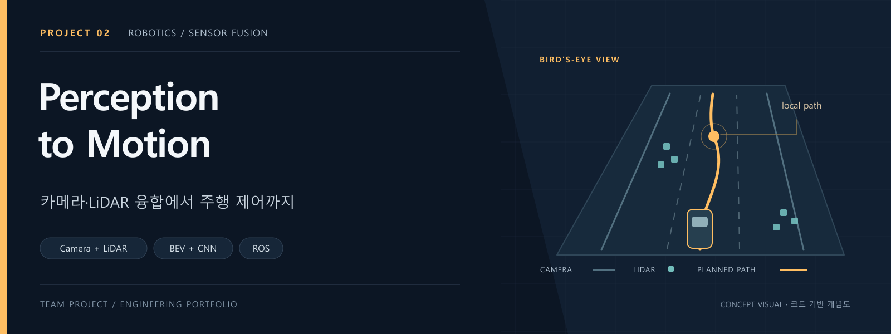
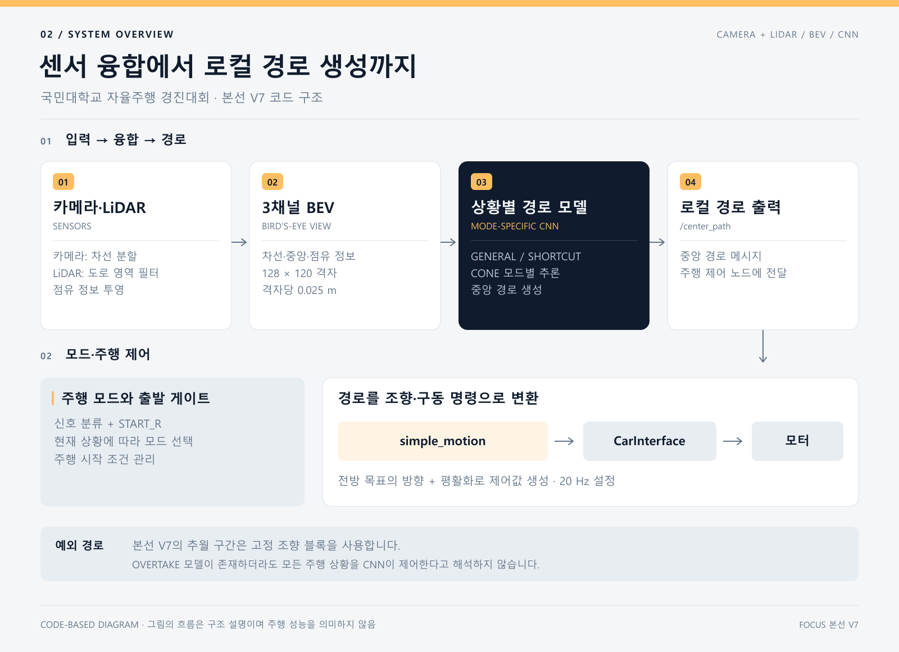

# 2026 국민대학교 자율주행 경진대회
### Legend KHUSLA · 예선 시뮬레이터부터 본선 실차 V7까지

카메라와 LiDAR로 주행 환경을 인식하고, 상황에 맞는 경로를 생성해 차량의 조향과 속도를 제어한 프로젝트입니다. 이 포트폴리오는 예선의 곡선 피팅 기반 주행에서 본선의 BEV·CNN 기반 주행으로 이어지는 구현과 설계 선택을 정리합니다. 전체 코드는 연결된 원본 저장소에서 확인할 수 있습니다.

> **처음 보신다면:** 아래 구조도 → 핵심 설계 → 코드 안내 순서로 읽으면 프로젝트의 입력·판단·출력 흐름을 빠르게 파악할 수 있습니다.

| 항목 | 내용 |
|---|---|
| 프로젝트 | 2026 국민대학교 자율주행 경진대회 · 예선 / 본선 |
| 핵심 분야 | 컴퓨터 비전 · 센서 융합 · 경로 생성 · 차량 제어 |
| 주요 기술 | Python · ROS 2 · OpenCV · YOLO · PyTorch · OpenVINO |
| 본선 기준 | V7 · 팀 원본 커밋 `467f6dd` |

[전체 코드](https://github.com/jounget5411-lab/2026-Legend-KHUSLA) · [본선 V7 상세 안내](https://github.com/jounget5411-lab/2026-Legend-KHUSLA/blob/8036461664402a54821b0665a4434e961f9a2e76/본선_최종_V7_안내.md) · [배포 모델 기록](https://github.com/jounget5411-lab/2026-Legend-KHUSLA/tree/8036461664402a54821b0665a4434e961f9a2e76/본선_배포모델)

## 어떤 시스템인가요?

자율주행 차량이 처리해야 하는 문제를 세 단계로 나눴습니다.

1. **인지:** 카메라에서 차선·중앙선·신호·라바콘 구간 표식을 검출하고, LiDAR로 주변 점군을 얻습니다.
2. **판단:** 카메라와 LiDAR 정보를 차량 기준의 BEV에 모으고, 일반 주행·지름길·라바콘 등 현재 상황에 맞는 경로를 생성합니다.
3. **제어:** 선택한 경로의 전방 목표점을 따라 조향을 계산하고, 모드별 속도와 가감속 설정을 차량 명령으로 변환합니다.

예선은 차선과 라바콘의 2차 곡선 피팅을 중심으로 구성했습니다. 실차 이식 과정을 거친 본선 V7에서는 센서 정보를 BEV로 정리하고 상황별 CNN으로 경로를 생성합니다.

## 본선 V7의 데이터 흐름

**구조도는 본선 V7 소스와 최종 설정을 기준으로 작성했습니다.** 네 가지 CNN 모델을 준비해 활성 모드의 모델을 추론하지만, 최종 장애물 회피 설정은 `hardcoded_all`입니다. 이 구간에서는 장애물 방향을 판단한 뒤 정해진 조향 블록이 일시적으로 조향을 담당합니다.

## 핵심 설계

### 1. 서로 다른 센서 정보를 같은 좌표에서 사용

YOLO가 만든 차선·중앙선 마스크를 BEV로 변환하고, LiDAR 점을 동일한 격자에 올립니다. 본선 코드의 격자는 **128 × 120**, 해상도는 **셀당 2.5 cm**입니다. CNN 입력은 중앙선·차선·LiDAR의 세 채널로 구성됩니다.

일반 주행에서는 흰색 차선 바깥의 LiDAR 점을 걸러 경로 모델에 전달합니다. 라바콘 모드는 학습 시 사용한 입력 조건에 맞춰 거리 보정과 자차 영역 제거를 적용한 LiDAR를 사용합니다.

### 2. 주행 상황에 따라 경로 모델과 제어 설정을 전환

`GENERAL`, `SHORTCUT`, `OVERTAKE`, `CONE` 모드를 정의하고, 프레임마다 활성 모드의 CNN 하나를 추론합니다. 신호·구간 표식·도로 안 장애물의 관측 결과를 모드 판단에 사용합니다.

모드별로 전방 주시 거리, 조향 게인, 평활화 계수, 목표 속도 설정을 분리했습니다. 제어 루프는 **20 Hz로 설정**하고, 명시적인 정지 명령과 가감속 램프를 별도로 처리합니다.

### 3. 모델과 실행 조건을 함께 보관

모델 가중치만 모아두지 않고, 최종 설정의 기대 SHA-256과 연결한 배포 기록을 포함했습니다. 4개 경로 CNN과 검출·분류 모델, OpenVINO 변환 파일을 구분해 보관합니다.

### 4. 최신 입력과 진단 화면을 중심으로 지연을 관리

카메라 입력은 아직 처리하지 못한 프레임을 계속 쌓지 않고 최신 프레임으로 교체하는 구조입니다. 경로 생성 단계에서는 BEV의 시각과 가까운 LiDAR 스캔을 연결하고, 입력의 지연과 경로 형식을 검사합니다.

진단 뷰어는 활성 CNN에 실제 전달한 세 채널 입력을 구독합니다. 카메라·BEV·경로·모드·차량 명령을 함께 살펴볼 수 있도록 구성하고, 주행 실행에서는 뷰어를 선택적으로 켤 수 있게 했습니다.

## 개발 단계

| 단계 | 접근 방식 | 확인할 코드 |
|---|---|---|
| 예선 | YOLO 인식, 카메라·LiDAR 융합, 곡선 피팅과 상태 머신, 다점 경로 추종 | [예선 코드](https://github.com/jounget5411-lab/2026-Legend-KHUSLA/tree/8036461664402a54821b0665a4434e961f9a2e76/예선/src/track_drive) |
| 실차 초기 이식 | 예선의 곡선 피팅 로직을 차량 환경에 연결 | [보관 코드](https://github.com/jounget5411-lab/2026-Legend-KHUSLA/tree/8036461664402a54821b0665a4434e961f9a2e76/보관/예선코드_차량이식) |
| 본선 V7 | YOLO·BEV·LiDAR와 상황별 CNN, 단순 경로 추종, 고정 조향 기반 장애물 회피 | [본선 코드](https://github.com/jounget5411-lab/2026-Legend-KHUSLA/tree/8036461664402a54821b0665a4434e961f9a2e76/본선/src/track_drive_cnn_gpt) |

## 코드를 빠르게 살펴보려면

| 관심 내용 | 먼저 볼 파일 |
|---|---|
| 카메라 인식과 BEV 생성 | [yolo_bev_node.py](https://github.com/jounget5411-lab/2026-Legend-KHUSLA/blob/8036461664402a54821b0665a4434e961f9a2e76/본선/src/track_drive_cnn_gpt/track_drive_cnn_gpt/yolo_bev_node.py) |
| LiDAR 결합과 경로 모델 선택 | [cnn_path_node.py](https://github.com/jounget5411-lab/2026-Legend-KHUSLA/blob/8036461664402a54821b0665a4434e961f9a2e76/본선/src/track_drive_cnn_gpt/track_drive_cnn_gpt/cnn_path_node.py) |
| 조향·속도 계산 | [simple_motion_node.py](https://github.com/jounget5411-lab/2026-Legend-KHUSLA/blob/8036461664402a54821b0665a4434e961f9a2e76/본선/src/track_drive_cnn_gpt/track_drive_cnn_gpt/simple_motion_node.py) |
| 최종 모델·인지 설정 | [perception_cnn.yaml](https://github.com/jounget5411-lab/2026-Legend-KHUSLA/blob/8036461664402a54821b0665a4434e961f9a2e76/본선/src/track_drive_cnn_gpt/config/perception_cnn.yaml) |
| 모드별 제어 설정 | [simple_motion.yaml](https://github.com/jounget5411-lab/2026-Legend-KHUSLA/blob/8036461664402a54821b0665a4434e961f9a2e76/본선/src/track_drive_cnn_gpt/config/simple_motion.yaml) |
| 모델 파일과 검증 범위 | [manifest.json](https://github.com/jounget5411-lab/2026-Legend-KHUSLA/blob/8036461664402a54821b0665a4434e961f9a2e76/본선_배포모델/manifest.json) |

## 실행 환경과 코드 출처

[구현 범위와 실행 참고](docs/technical-notes.md) · [주장별 근거 코드](docs/source-guide.md)

본선은 Ubuntu·ROS 2 Humble과 차량별 센서·모터 설정을 전제로 합니다. 모델 배치와 환경 복원 조건은 [본선 V7 안내](https://github.com/jounget5411-lab/2026-Legend-KHUSLA/blob/8036461664402a54821b0665a4434e961f9a2e76/본선_최종_V7_안내.md)에 정리했습니다.

전체 구현은 팀 프로젝트 결과물이며, 본선 V7은 [KHUSLA-SANDI/KOOKMIN의 고정 커밋](https://github.com/KHUSLA-SANDI/KOOKMIN/tree/467f6dda6b71c48567225d3260d925d72818e3c1)에 기반합니다. 이 포트폴리오는 [보관 저장소의 8036461 커밋](https://github.com/jounget5411-lab/2026-Legend-KHUSLA/tree/8036461664402a54821b0665a4434e961f9a2e76)을 기준으로 작성했습니다.

---

[FPGA 드론 프로젝트](https://github.com/jounget5411-lab/fpga-drone-portfolio) · [HL FMA 2025 프로젝트](https://github.com/jounget5411-lab/hlfma-2025-portfolio)
