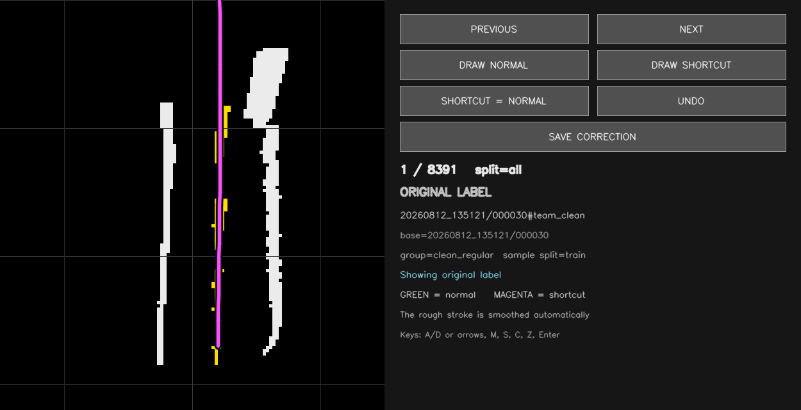

# 실차에서 발견한 문제와 설계 판단

[프로젝트 소개로 돌아가기](../README.md)

예선 시뮬레이터의 주행 구조를 실차로 확장하면서, 차선 표현·센서 입력·전송 지연·모터 제어를 단계별로 개선했습니다. 증상을 재현하고 원인을 분리해 설계에 반영한 다섯 가지 사례입니다.

## 1. 해상도를 높이기 전에, 사라진 차선의 위치부터 찾기

**문제.** 점선 중앙선이 몇 조각만 검출되면 2차곡선 경로가 흔들렸고, 갈림길에서는 두 경로를 구분하기 어려웠습니다. 처음에는 1920 × 1080 영상을 작은 YOLO 입력으로 바꾸는 과정에서 좌우 차선이 잘린다고 의심했습니다.

**확인.** 검출 마스크와 후처리 결과를 비교했습니다. 화면을 단순히 잘라내는 문제가 아니라, 전방 거리의 5 cm 구간마다 횡방향 중앙값 하나를 남기는 과정에서 여러 차선이 합쳐지고 있었습니다. 검출된 정보가 경로 모델에 도착하기 전에 없어지는 문제였습니다.

**변경.** 대표점으로 축약하는 대신 마스크의 2차원 점유 형태를 BEV에 보존했습니다. 노란 중앙선·흰 경계선·LiDAR를 같은 좌표계의 세 채널로 만들고, 전방 28개 고정 위치의 횡방향 좌표와 유효도를 예측하도록 했습니다. CNN의 경로 생성과 모터 제어를 분리해 각 단계의 입력·출력과 동작을 독립적으로 확인할 수 있도록 했습니다.

[BEV 전후 비교 화면](../assets/bev-representation-comparison.png) · [입력·출력 규격](https://github.com/jounget5411-lab/2026-Legend-KHUSLA/blob/8036461664402a54821b0665a4434e961f9a2e76/본선/src/track_drive_cnn_gpt/track_drive_cnn_gpt/path_contract.py#L20-L32)

### 새 표현에 맞는 정답 경로 만들기

실차 카메라와 LiDAR를 함께 저장하고, 학습 데이터에도 차량과 같은 YOLO·캘리브레이션·BEV 변환을 적용했습니다. 자동 생성한 경로 후보는 사람이 화면에서 검수하고 잘못된 샘플만 다시 그렸습니다. 수정 경로는 원본을 덮지 않고 별도 파일에 저장해 재학습 시 변경 이력을 확인할 수 있게 했습니다.

*경로 라벨 보정 도구: 일반·지름길 경로를 직접 수정하고 원본과 분리해 저장합니다.*

일반 주행 모델은 주행 시퀀스 단위로 학습·검증·테스트 데이터를 분리했습니다. 연속 프레임의 유사 장면이 학습과 평가에 섞이는 것을 방지하고, 별도로 분리한 테스트 321장에서 **경로 예측 MAE 8.045 cm**를 기록했습니다.

## 2. LiDAR를 켜면 오히려 경로가 나빠지는 현상

**문제.** LiDAR를 끄면 안정적인 경로가 나오지만 켜면 경로가 급격히 나빠졌습니다. 모델 구조와 센서 시간 동기화를 모두 의심할 수 있는 상황이었습니다.

**확인.** 같은 장면에서 LiDAR 채널만 켜고 꺼 원인을 분리했습니다. 개발 기록의 비교 표본에서 학습용 합성 장애물은 27–67개 셀에 분포한 반면, 실차 스캔에는 94–498개 셀의 점유가 생겼습니다. 실제 입력에는 벽·차체·사람·다수의 콘이 함께 포함되어 있었습니다.

**변경.** 실제 경기장 카메라·LiDAR 데이터를 다시 수집하고, 학습과 실행에 같은 전처리를 사용했습니다. 일반·지름길·추월 모델에는 흰 차선 밖의 LiDAR 점을 제거했습니다. 라바콘 구간은 바깥쪽 콘도 경로를 정하는 단서이므로 같은 도로 필터를 적용하지 않았습니다.

핵심 판단은 센서 수를 늘리는 것보다 **각 채널이 학습할 때와 차량에서 같은 의미를 갖게 하는 것**이었습니다. 최종 코드에도 CONE과 그 외 모드의 LiDAR 처리가 나뉘어 있습니다.

[모드별 LiDAR 처리](https://github.com/jounget5411-lab/2026-Legend-KHUSLA/blob/8036461664402a54821b0665a4434e961f9a2e76/본선/src/track_drive_cnn_gpt/track_drive_cnn_gpt/cnn_path_node.py#L897-L933)

## 3. 단독 실행 50 ms와 실주행 181 ms의 차이

**문제.** OpenVINO 검출 모델은 단독 실행에서 약 50 ms였지만, 실주행에서는 평균 약 181 ms까지 느려졌습니다. 모델의 스레드 수만 조정해서는 전체 시스템에서 발생하는 지연을 설명하기 어려웠습니다.

**확인.** CPU 부하를 늘리며 지연을 재현하고 브리지 시작 시각, 프로세스 부하, 영상 전송을 대조했습니다. 모든 토픽을 연결하는 브리지가 1080p 원본뿐 아니라 compressed·Theora 등의 영상 형식도 함께 처리하고 있었습니다. 직렬화와 불필요한 영상 변환이 추론과 CPU를 나눠 쓰고 있었습니다.

**변경.** 필요한 토픽에만 연결하는 브리지와 원본 영상 중심 전송을 사용했습니다. 아직 처리하지 못한 카메라 프레임은 최신 입력으로 교체하고, 같은 장치의 ROS 전송에는 공유 메모리를 사용했습니다. 뷰어는 제어 노드와 분리해 필요한 때만 실행했습니다.

같은 녹화 프레임으로 실행 방식을 비교한 결과, YOLO 추론 지연의 p50을 **PyTorch 91.76 ms에서 OpenVINO 51.03 ms**로 줄였습니다. 경로 생성 파이프라인은 2026-08-21의 뷰어·브리지 제외 조건에서 **11.948 Hz**를 기록했습니다.

[최신 프레임 버퍼](https://github.com/jounget5411-lab/2026-Legend-KHUSLA/blob/8036461664402a54821b0665a4434e961f9a2e76/본선/src/track_drive_cnn_gpt/track_drive_cnn_gpt/yolo_bev_node.py#L60-L91) · [필요 토픽만 연결하는 모터 브리지](https://github.com/jounget5411-lab/2026-Legend-KHUSLA/blob/8036461664402a54821b0665a4434e961f9a2e76/본선/src/track_drive_cnn_gpt/tools/motor_up_gpt.sh)

## 4. 차량의 꿀렁임을 경로 문제로 단정하지 않기

**문제.** 속도 명령을 높일 때 차량이 꿀렁였습니다. VESC의 fault 값은 0이어서 오류 코드만 보면 원인을 놓칠 수 있었습니다.

**확인.** 전압·모터 전류·입력 전류를 관찰했습니다. 급가속 시험에서는 전압 강하와 전류 증가가 함께 나타났고, 하위 ROS 1 모터 노드에는 약 0.77초 동안 콜백을 막는 속도 램프가 있었습니다. 전기적 부하와 소프트웨어 지연이 서로 다른 문제였습니다.

**변경.** 모터 명령 발행은 20 Hz로 유지하고, 속도 값의 상승량을 제어 틱당 0.25로 제한했습니다. 속도 변화량 제한의 책임을 상위 `simple_motion`으로 모으고 하위의 블로킹 램프를 제거했습니다. 감속은 더 빠르게 처리하며 명시적 정지는 같은 틱에 0을 발행하도록 구분했습니다.

이 설정에서 속도 명령은 0→12까지 약 2.4초에 걸쳐 증가하며, 가속·감속·명시적 정지를 각각의 동작 목적에 맞게 처리합니다.

[최종 속도 변화량 설정](https://github.com/jounget5411-lab/2026-Legend-KHUSLA/blob/8036461664402a54821b0665a4434e961f9a2e76/본선/src/track_drive_cnn_gpt/config/simple_motion.yaml) · [제어 코드](https://github.com/jounget5411-lab/2026-Legend-KHUSLA/blob/8036461664402a54821b0665a4434e961f9a2e76/본선/src/track_drive_cnn_gpt/track_drive_cnn_gpt/simple_motion_node.py)

## 5. 실차 통합을 고려한 최종 시스템 구성

플랫폼 선정에서는 추론 속도와 함께 모터·드라이버·전원·소프트웨어 의존성의 통합 상태를 고려했습니다. 기존 CPU 차량을 유지하면서 전송과 추론의 병목을 줄여, 구성 요소를 실차 주행 시스템으로 통합했습니다.

신호등의 LEFT와 GREEN 구분을 개선하기 위해 신호등 전체 박스를 검출하고 해당 영역만 별도 분류기로 판별하는 2단 구조를 적용했습니다. 신호등이 있는 프레임에서만 분류기를 실행해 연산량을 관리했습니다.

최종 V7의 추월에는 LiDAR로 장애물의 좌우를 판단하고 실차에서 조정한 고정 조향 블록을 실행하는 전략을 적용했습니다. `simple_motion` 안에서 경로 추종과 배타적으로 실행해 제어 명령을 일원화했으며, 코드와 모델을 함께 버전 관리했습니다.

최종 시스템으로 **전체 코스를 완주하고 본선 8위**를 기록했습니다. 차선 인식부터 학습 데이터 구축, 센서 융합, 경로 추론, 차량 제어까지 전 과정을 연결했습니다.

[최종 추월 전략과 경로 선택](https://github.com/jounget5411-lab/2026-Legend-KHUSLA/blob/8036461664402a54821b0665a4434e961f9a2e76/본선/src/track_drive_cnn_gpt/track_drive_cnn_gpt/cnn_path_node.py#L1022-L1046) · [성능과 설계 상세](technical-notes.md)
